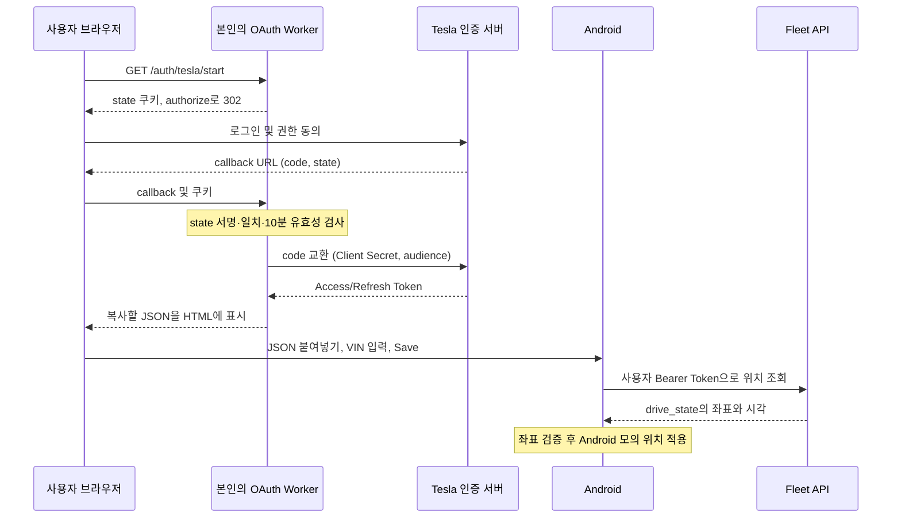

# Tesla Fleet API와 Android 모의 GPS 구현 가이드

신규 구성은 [README](../README.md)와 [서버 온보딩](../server/README.md)을 기준으로 진행합니다. 이 문서는 소스의 데이터 흐름과 테스트 제약을 설명합니다. 모든 식별자·토큰·좌표 예시는 가상이며 운영 서버를 제공하지 않습니다.

## 인증 정보와 설정

Client ID는 개발자 앱의 공개 식별자입니다. Client Secret은 서버 비밀값이며 APK에 넣지 않습니다. Partner Token은 앱의 도메인 등록용이고, 사용자 Access Token은 차량 API 호출용입니다. Refresh Token은 갱신에 사용합니다. VIN은 개인 차량 식별정보이므로 앱에서 입력합니다.

공개 기본값은 `config/tesla.defaults.properties`, 개인 Android 설정은 무시되는 `android/tesla.properties`, 서버 설정은 `server/wrangler.toml`과 Cloudflare Secret에 둡니다. 모든 변수·우선순위·파생 URL은 [README 변수 표](../README.md#설정-변수-전체-목록)에 있습니다. 서버의 `AUDIENCE`, Partner 등록 지역, 앱에서 선택한 Fleet 지역이 일치해야 합니다.

공개키는 P-256 PEM이며 `ORIGIN/.well-known/appspecific/com.tesla.3p.public-key.pem`에 게시합니다. 개인키는 게시하지 않습니다. Partner 등록은 해당 지역의 `/api/1/partner_accounts`에 호스트만 전송합니다. [Tesla Partner API](https://developer.tesla.com/docs/fleet-api/endpoints/partner-endpoints)

## 실제 데이터 흐름



Worker는 위치 요청을 프록시하지 않습니다. 로그인 callback의 `redirect_uri`는 `ORIGIN/auth/tesla/callback`이며 Tesla 포털 등록값·authorize 요청·코드 교환 요청이 같아야 합니다. 로그인 비밀번호와 MFA는 Tesla 페이지에서만 입력합니다.

OAuth 요청 범위는 `openid offline_access vehicle_device_data vehicle_location`입니다. Worker는 사용자 Token을 DB에 저장하지 않지만 코드 교환과 성공 HTML 생성 중 메모리에서 처리합니다. 쿠키는 Secure/HttpOnly/SameSite=Lax이며 state는 Client Secret으로 서명합니다. Callback 오류 시 쿠키를 지우고 고정 진단 코드만 반환합니다. 로그와 트레이스에 callback 쿼리·토큰 응답이 기록되지 않게 운영해야 합니다.

인증 요청은 [Tesla Third-Party Tokens](https://developer.tesla.com/docs/fleet-api/authentication/third-party-tokens)의 Authorization Code/Refresh Token 흐름을 따릅니다. 서버와 앱 모두 토큰 요청에서 리디렉션을 따라가지 않습니다.

## 앱의 저장과 자동 갱신

브라우저 결과는 다음 형식의 JSON입니다. `expires_at`은 Unix epoch **밀리초**이며 Tesla의 `expires_in` **초**를 변환한 값입니다. 아래 값은 실행용 자격 증명이 아닙니다.

```json
{
  "access_token": "<USER_ACCESS_TOKEN>",
  "refresh_token": "<USER_REFRESH_TOKEN>",
  "expires_at": 1800003600000,
  "client_id": "<YOUR_CLIENT_ID>"
}
```

앱에서 VIN을 입력하면 함께 저장됩니다. JSON에 `client_id`가 있으면 빌드 기본값보다 우선합니다. 개발자 앱을 바꿀 때는 저장된 정보를 Clear하고 다시 로그인해야 합니다.

- Android Keystore AES-GCM으로 전체 JSON을 암호화하여 SharedPreferences에 저장합니다. Manifest의 `allowBackup=false`와 인증/GPS 화면의 `FLAG_SECURE`를 적용합니다.
- 만료까지 60초 이내이거나 위치 API 401이면 갱신합니다. 새 Access/Refresh Token을 함께 저장합니다. 401 재조회는 한 번만 수행합니다.
- 갱신 중 Save/Clear로 저장 revision이 달라지면 늦게 도착한 결과를 폐기합니다. 갱신 실패만으로 저장값을 삭제하지 않습니다.
- Refresh Token이 없거나 만료·철회되면 재로그인합니다. 프로세스 종료 중 정기 갱신하지 않습니다.
- Clear는 로컬 값과 실행 중인 모의 GPS를 정리합니다. Tesla 계정의 OAuth 동의 철회는 별도입니다. 기기 키가 손실되면 저장된 암호문을 복구할 수 없습니다.

## 위치 조회와 모의 위치

```http
GET /api/1/vehicles/<VIN>/vehicle_data?endpoints=location_data HTTP/1.1
Host: <SELECTED_FLEET_HOST>
Authorization: Bearer <USER_ACCESS_TOKEN>
Accept: application/json
```

`FleetLocationClient`는 `response.drive_state`의 수치형 `latitude`, `longitude`, `timestamp`를 읽습니다. 위도·경도 범위와 유한성을 검사하며 0도 허용합니다. 시각은 현재 기준 5분보다 오래되거나 60초보다 미래이면 거절합니다. 이 시간 제한은 프로젝트의 검증 정책입니다.

API 조회와 모의 위치 주입 주기는 다릅니다. 정상 조회는 버튼당 1회이며 같은 좌표를 1초마다 주입하다 5분 후 중지합니다. 새 Android Location의 시각이 최신이어도 차량을 다시 조회한 것은 아닙니다. 차량 자동 깨우기·이동 추적은 없습니다.

Android GPS/Network 공급자와 Google Fused Location mock mode를 사용합니다. Play 서비스가 없으면 GPS/Network만 적용합니다. 지도 앱이 모의 위치를 무시할 수도 있습니다. 지도 핀과 기기 내 위치는 각각 확인하고 사용 후 중지합니다. 실제 위치는 다음 실제 수신부터 복원됩니다. [사용 순서](../GPS_TEST.md)

## Python 예제

`docs/examples/fleet_location.py`는 macOS/Linux에서 표준 라이브러리만 사용합니다. 다음 JSON을 개인 파일에 본인 값으로 구성합니다. 토큰 자체는 채팅이나 공개 저장소에 올리지 않습니다.

```json
{
  "access_token": "<USER_ACCESS_TOKEN>",
  "refresh_token": "<USER_REFRESH_TOKEN>",
  "expires_at": 0,
  "client_id": "<YOUR_CLIENT_ID>",
  "vin": "<YOUR_17_CHARACTER_VIN>"
}
```

```sh
chmod 600 artifacts/tesla-fleet/user-token.json
TESLA_DEFAULT_REGION=NA python3 docs/examples/fleet_location.py artifacts/tesla-fleet/user-token.json
```

`expires_at: 0`은 만료 미확인 상태이며 401 때 갱신합니다. 서버 결과의 만료 시각이 있다면 그대로 사용합니다. 스크립트는 파일 소유권·권한을 확인하고 갱신한 토큰을 권한 600의 임시 파일에서 원자적으로 교체합니다. 파일 잠금은 이 스크립트 사이에서만 유효합니다. Android와 토큰 묶음을 공유하여 동시에 갱신하지 마세요. 성공 시 실제 좌표를 출력하므로 결과도 개인정보입니다.

## 검증과 문제 해결

빌드·단위 테스트·Lint는 [README 명령](../README.md)으로 실행합니다. 서버 테스트는 설정 반영, 쿠키 검증, HTML 이스케이프, 리디렉션 거절, 진단 정보 비노출을 모킹으로 확인합니다. Android는 파싱·좌표 검증·갱신·동시 저장 변경을 검사합니다. 계측 테스트는 실제 연결된 테스트 기기에서 별도 실행하며 `make android-ui-test`는 해당 앱 설치·실행을 수행합니다.

401은 인증/갱신, 403은 사용자 동의·Partner 등록·앱 상태, 404는 VIN·지역, 408은 차량 온라인 상태, 429는 사용 한도를 확인합니다. 현재 비용·차량 지원 여부는 [Tesla 공식 문서](https://developer.tesla.com/docs/fleet-api/getting-started/what-is-fleet-api)에서 확인하세요. 코드 테스트는 계정 설정 완료나 실제 차량 동작을 보장하지 않습니다.

도식: [전체 흐름](diagrams/tesla-fleet.html), [OAuth 상세](diagrams/tesla-oauth-detail.html). 도식의 URL은 예시이며 실제 설정은 README를 기준으로 합니다.
